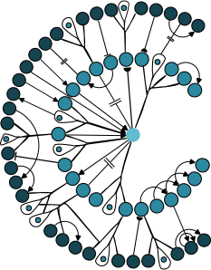

  

# CeDNe (pronounced "Sid-nee")

**CeDNe** is a modular, extensible Python library for multi-omic integration and systems-level modeling of the *C. elegans* nervous system. It enables researchers to **represent, combine, analyze, and simulate complex neuronal data** using a flexible, graph-based object model.

Built on top of [NetworkX](https://networkx.org/), CeDNe allows intuitive access to neurons, connectomes, gene expression data, neurotransmitter systems, neuropeptide signaling, and calcium imaging activity — all structured in one coherent framework. This design supports both **high-level exploratory workflows** and **low-level modeling and simulation pipelines**.

---

## What CeDNe Can Do

- **Multi-omic integration**: unify anatomical, transcriptomic, neurochemical, and functional data
- **Motif search and path analysis**: identify structural motifs, compute paths, and trace information flow
- **Neuron-annotated visualizations**: render 2D/3D plots with contextual labels and spatial alignment
- **Data contextualization**: map new experimental data (e.g., RNA-seq, imaging) onto known connectomic structures
- **Graph-based simulation and optimization**: simulate neural activity and optimize parameters using Optuna
- **Workflow examples**: ready-to-run notebooks for tasks ranging from data loading to motif-based simulation

---

## Why Use CeDNe?

- Designed specifically for *C. elegans* neuroscience
- Combines object-oriented structure with flexible graph analytics
- Easy integration into existing Python pipelines
- Modular API with support for advanced users, but approachable for beginners

---

## Getting Started

You can start exploring with just a few lines of code and minimal setup. See the [`examples/notebooks`](https://github.com/sahilm89/CeDNe/tree/main/examples/notebooks) folder or try interactive notebooks in Binder:

For more notebooks, see the full list below:

### 01. Create Worm and Graph Connections

Builds the worm object and initializes anatomical connectivity.

---

### 02. Save Worm and Load Worm

Demonstrates serialization and deserialization of the worm model to/from disk.

---

### 03. Fold Network and Load Data

Introduces tools for network folding and attaches experimental data to network nodes.

---

### 04. Load Transcripts and View Positions

Loads transcriptomic data and maps neuron positions in anatomical space.

---

### 05. View 3D Positions

Interactive 3D visualization of neuron spatial layout using matplotlib.

---

### 06. Load Neuropeptides

Attaches neuropeptide expression data to neurons.

---

### 07. Load Neurotransmitters and Make Putative Graphs

Builds putative synaptic graphs using neurotransmitter and receptor identity.

---

### 08. All Paths Between Neuron Pair

Computes and visualizes all possible paths between selected neuron pairs.

---

### 09. Load Different Connectomes

Loads and compares multiple anatomical or functional connectomes.

---

### 10. Time Series and Correlations

Analyzes calcium imaging time series and computes neuron-neuron correlation matrices.

---

### 11. Motif Search

Detects common topological motifs in the connectome using motif-finding tools.

---

### 12. Subnetwork Connectivity

Explores connectivity patterns in user-defined neuron subnetworks.
